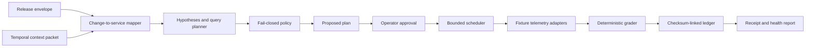

# Architecture

## Data Flow

## Components

`internal/domain` defines release, context, hypothesis, query, approval,
observation, verdict, and receipt contracts. Stable IDs and evidence digests
are derived from canonical JSON representations.

`internal/corpus` provides 25 deterministic release scenarios across eight
fictional services. It covers application, feature flag, schema, dependency,
and infrastructure changes plus immediate, delayed, intermittent, missing,
failed, ambiguous, unrelated, and healthy telemetry.

`internal/mapping` maps changed paths to services and expands schema or
dependency changes through reverse dependencies. It consumes typed temporal
context packets and rejects future evidence. Unknown paths remain explicit.

`internal/planning` generates evidence-linked failure hypotheses and bounded
Prometheus, Tempo, and Loki queries. Directly released services are prioritized
before downstream expansion. Policy caps query count, range, cadence, duration,
cost, backend access, sensitive references, and write-like expressions.

`internal/telemetry` implements read-only fixture adapters, deadlines, result
caps, and pre-digest log redaction. The deterministic grader distinguishes
healthy, unhealthy, ambiguous, missing telemetry, query failure, and
insufficient evidence.

`internal/watch` executes only approved plans. Real and virtual clock
interfaces support production-shaped scheduling and fast deterministic replay.
Material failures stop the watch; ambiguous evidence remains visible and does
not collapse to healthy.

`internal/ledger` appends JSONL events linked by SHA-256 hashes. Verification
detects edits, deletion within the chain, reordering, and malformed records.
Receipt reconstruction uses the verified release, plan, observations, and
final verdict.

`internal/webhook` is an in-process HTTP simulator for release intake and
approve/edit/cancel actions. It requires bearer authentication, replay-window
timestamps, unique nonces, and idempotency keys. Intake can only propose;
approval is the sole path to execution.

`internal/evaluation` runs the actual adaptive pipeline over every corpus
scenario and compares it with a fixed dashboard baseline. JSON and Markdown
reports expose coverage, precision, misses, noise, escalation quality, latency,
and query cost.

## Trust Boundaries

- Release and context evidence are inputs, not instructions.
- Mapping explanations cannot grant query or execution authority.
- Policy denial is fail-closed and prevents approval.
- Approval is versioned and attributed to an actor.
- Telemetry adapters are read-only and bounded by deadline and result count.
- Secrets and personal fields are redacted before raw-result digests.
- Missing or failed telemetry always requires attention.
- The ledger is tamper-evident, not an external immutable store.

## V1 Limits

- Fixture telemetry only; no Prometheus, Tempo, or Loki network clients.
- In-memory webhook state; restart persistence is limited to receipt ledgers.
- Shared bearer token rather than workload identity or signed payloads.
- No distributed scheduler, leader election, or delivery retry queue.
- Deterministic thresholds rather than statistically calibrated detectors.
- No write action, paging action, deployment mutation, or automated rollback.
